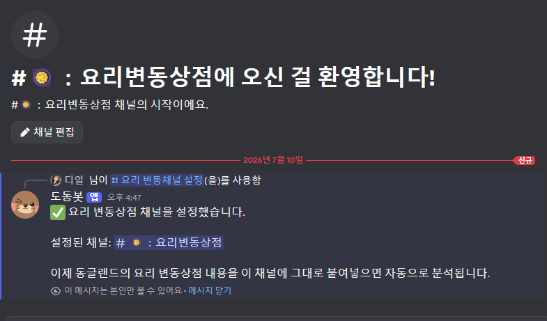
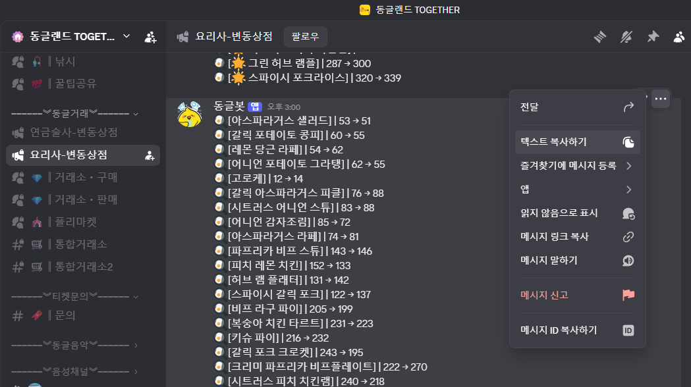
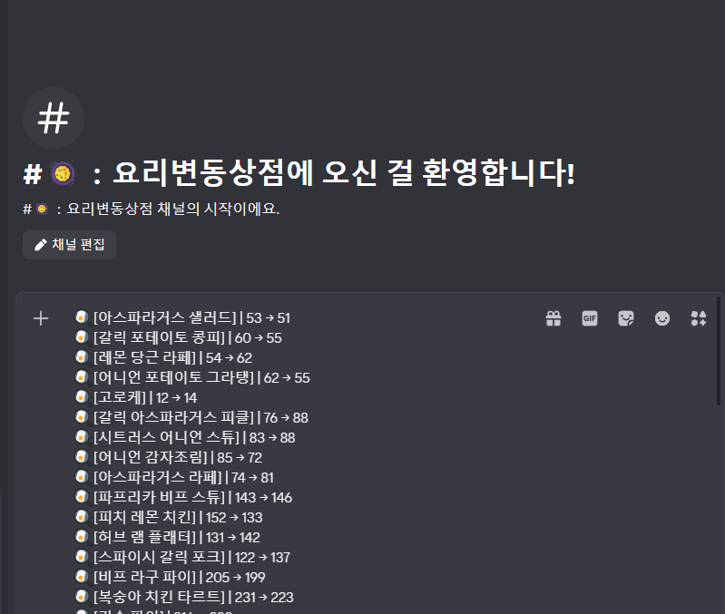
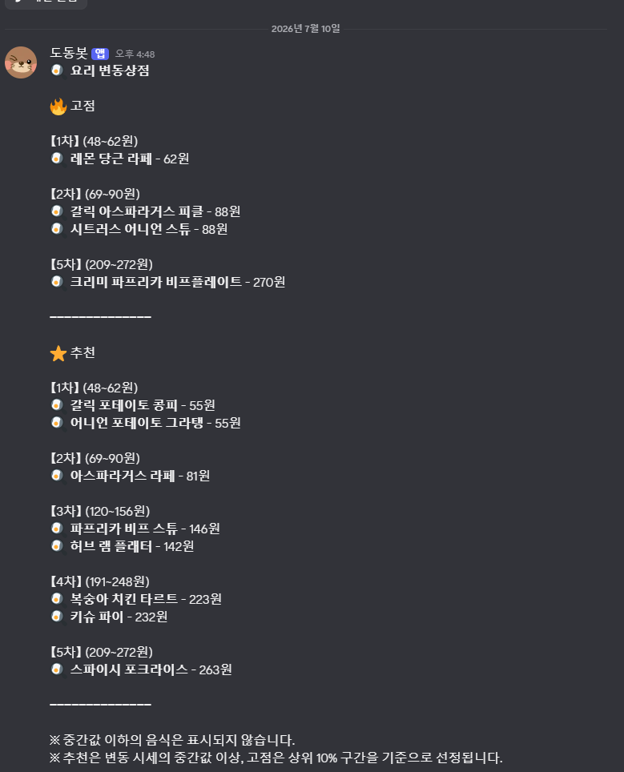
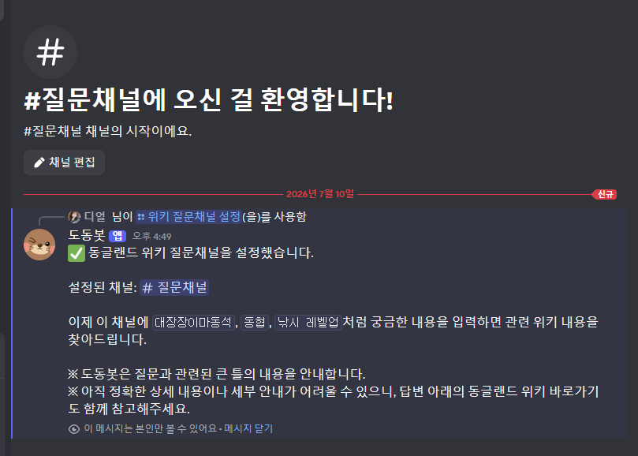
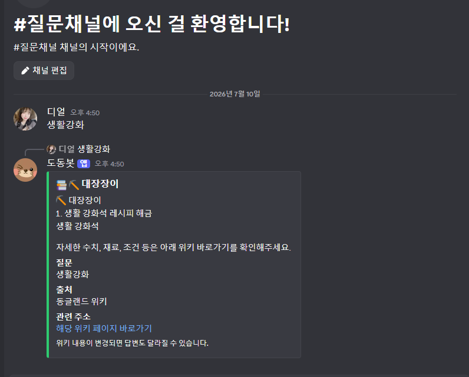

# 🤖 DodongBot

> 동글랜드를 더욱 편리하게 즐길 수 있도록 제작된 Discord Bot

---

## 📥 도동봇 초대

➡️ **[도동봇 초대하기](https://discord.com/oauth2/authorize?client_id=1524599732305920190&permissions=2416045056&integration_type=0&scope=bot+applications.commands)**

---

## ✨ 주요 기능

### 🍳 요리 변동상점
- 변동상점 요리를 자동 분석

### 🧪 연금 변동상점
- 연금 변동상점 자동 분석

### 📚 동글랜드 위키
- 위키 자동 검색 / 관련 페이지 안내
  
### 🤝 동협 계산기
- 물의 결정 개수만 입력하면 총 동협 포인트 자동 계산

### ⭐ 레벨 계산기
- 경험치를 입력하면 현재 필요 레벨 계산

### ✅ 도동마을 입주 인증
- 도동마을 전용 인증 시스템

---

# 📷 미리보기

## 🍳 요리 및 연금 변동상점

1. /요리 변동채널 설정 명령어로 원하는 채널을 지정합니다.
2. 동글랜드 요리 변동상점에 올라온 변동 내용을 복사합니다.
3. 설정된 채널에 붙여넣기만 하면 도동봇이 자동으로 분석하여 추천 요리를 안내합니다.

 
 

---

## 📚 동글랜드 위키

1. /위키 질문채널 설정 명령어로 원하는 채널을 지정합니다.
2. 설정된 채널에 궁금한 내용을 입력하면 도동봇이 동글랜드 위키를 검색하여 관련 정보를 안내합니다.

 

---

## 🚀 최신 버전

### v1.1.0
- 🍳 요리 변동상점
- 🧪 연금 변동상점
- 🤝 동협 계산기
- 📚 동글랜드 위키
- ⭐ 레벨 계산기

최신 업데이트 내용은 Releases에서 확인할 수 있습니다.

➡️ https://github.com/inthebell/DodongBot/releases

---

Made with by **디얼**
